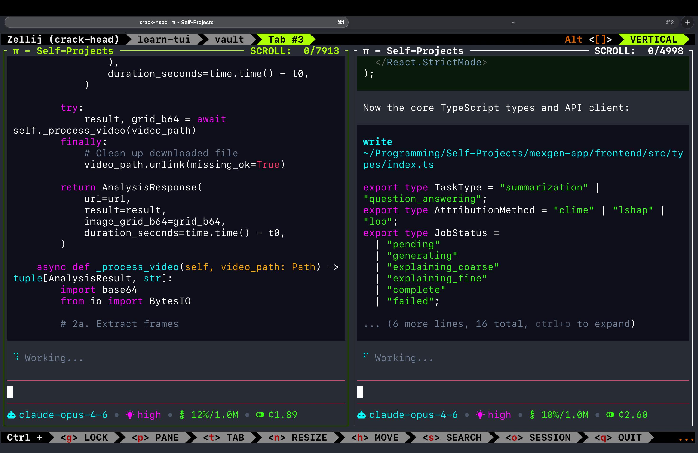

# pi-yat

Lean research tooling for [pi](https://github.com/mariozechner/pi). Turn papers into code, or turn problems into code + papers.

*yat* — from Tagalog *payat*, meaning lean.

## What it does

pi-yat gives pi two capabilities through a single lightweight extension:

1. **Paper → Code** (`/paper2code`) — Search arXiv for a research paper, read the full content, and generate a working code repository that implements the paper's core method.

2. **Research Problem → Code + Paper** (`/research2code`) — Describe a research problem. The AI searches for related work, presents a structured plan (problem framing, methodology, test strategy), waits for your approval, then builds both a code implementation with tests and a LaTeX paper with proper citations.

Three tools are registered for the LLM to use in any conversation:

- `search_papers` — keyword search across arXiv
- `get_paper_info` — paper metadata (title, authors, abstract)
- `read_paper` — full paper content as markdown

All of this in ~170 lines of TypeScript. No HTTP clients, no auth flows, no MCP servers. Just the `hf` CLI and well-crafted prompts.

## Demo

> **Note:** The demo videos were cut short due to GitHub's file size limits. The screenshot below shows pi continuing to generate code after the videos end. See [`examples/`](./examples/) for the finished applications from these demos.

### /paper2code

https://github.com/user-attachments/assets/22a2e2b0-0b6a-4b2c-97f3-a9b2b1248d75

### /research2code

https://github.com/user-attachments/assets/32f93aaf-6f6d-44a0-b8ad-174864ac53e4

### pi continuing to code after the demo videos



## Examples

The [`examples/`](./examples/) directory contains finished applications generated from the demo videos:

- [`examples/cryptoguard/`](./examples/cryptoguard/) — generated via `/research2code`
- [`examples/mexgen-app/`](./examples/mexgen-app/) — generated via `/paper2code`

## Prerequisites

Install the [HuggingFace CLI](https://huggingface.co/docs/huggingface_hub/en/guides/cli):

```bash
curl -LsSf https://hf.co/cli/install.sh | bash
```

## Install

```bash
pi install git:github.com/mr-jones123/pi-yat
```

## Usage

**Search by topic:**

```
/paper2code vision language models
```

**Direct arXiv ID:**

```
/paper2code 1706.03762
```

**Research problem to code + paper:**

```
/research2code efficient attention mechanisms for long sequences
```

## Dev

```bash
pi -e ./extensions/index.ts
```
